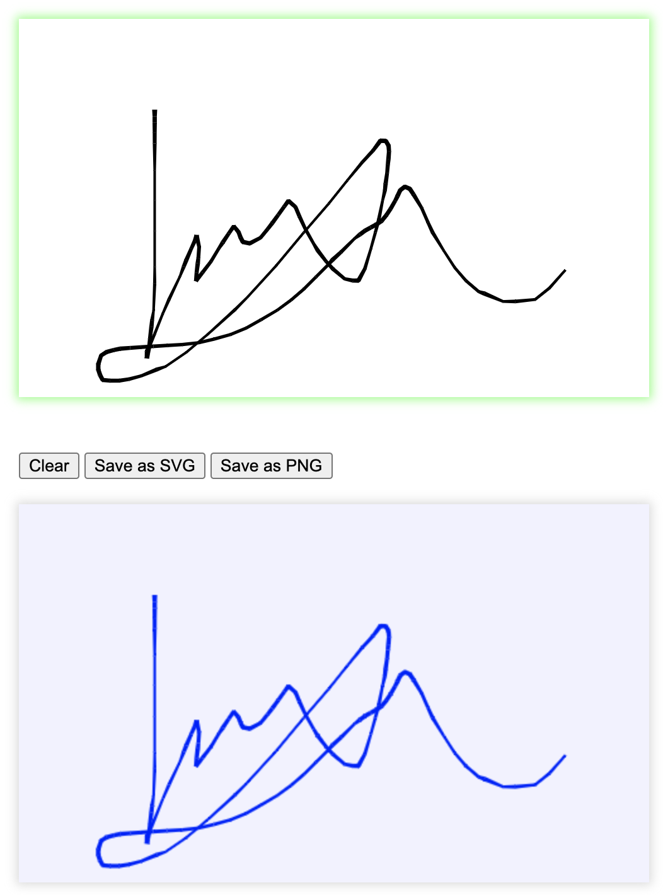

[](https://www.npmjs.com/package/sign-pad)
[](https://github.com/gullerya/sign-pad)

[](https://github.com/gullerya/sign-pad/actions/workflows/quality.yml)
[](https://codecov.io/gh/gullerya/sign-pad/branch/main)
[](https://app.codacy.com/gh/gullerya/sign-pad/dashboard)

# Summary

`sign-pad` delivers a web component, providing signature drawing surface and related services:
- smooth drawing experience
- customizable background
- convenient export API:
	- export as **SVG** or **canvas**
	- opt-in **trim** whitespace around the signature if needed
	- configurable **ink** and **fill** (background) of the exported image
- convenient interop API:
	- **empty** state reflected as property and attribute (for easy state based styling and logic)
	- `input` event upon each signature drawing touch (including clear)

The following picture produced by a simple example of `sign-pad` usage in [this CodePen](https://codepen.io/gullerya/pen/ZEBbGeO):

<p align="center">
	
</p>

# Usage example

Exmple below shows a full example of `sign-pad` usage: initiation, HTML, some styling to reflect focuses interaction and image extracton.

```js
import 'sign-pad';
```

# API

`sign-pad` functionality exposed as the fully-featured web-component, via the properties, methods and events of an actual DOM instance.

Full API documentation found [here](./docs/api.md).